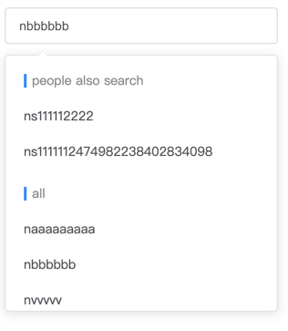

# el-suggest-autocomplete

suggestions grouped vue component for element-ui input-autocomplete

# requirement

```js
npm i vue
npm i element-ui
```

# installation

```js
npm i el-suggest-autocomplete
```
and import the lib globally or use as vue component

# screenshots

